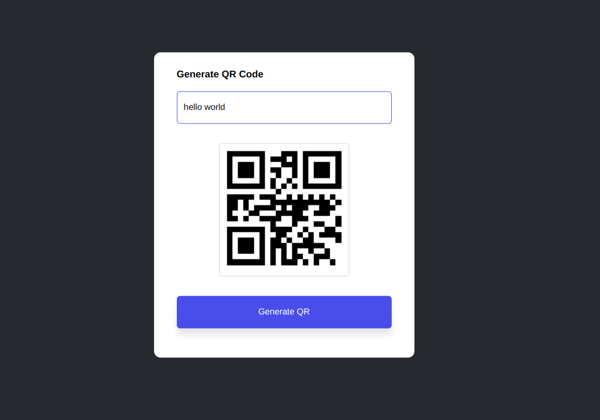

# QR Code Generator 📱

Welcome to the QR Code Generator project! This simple web application allows you to generate QR codes from any text or URL you input. It's built using HTML, CSS, and JavaScript.

## Features ✨

- **Generate QR Codes**: Convert any text or URL into a QR code.
- **Responsive Design**: The application is designed to be responsive and user-friendly.
- **Error Handling**: Alerts the user if the input field is empty.

## How to Use 🛠️

You can use the application directly by visiting [qrgenerator-lake.vercel.app](https://qrgenerator-lake.vercel.app).

Alternatively, you can run it locally:

1. **Clone the Repository**:
    ```bash
    git clone https://github.com/yourusername/qrgenerator.git
    ```
2. **Navigate to the Project Directory**:
    ```bash
    cd qrgenerator
    ```
3. **Open `index.html` in Your Browser**:
    ```bash
    open index.html
    ```

## Project Structure 📂

- `index.html`: The main HTML file containing the structure of the web application.
- `style.css`: The CSS file for styling the application.
- `README.md`: This file, providing an overview of the project.

## Code Explanation 🧩

### HTML

The `index.html` file contains the structure of the web application. It includes an input field for the text or URL, a button to generate the QR code, and a div to display the generated QR code.

### CSS

The `style.css` file styles the application, making it visually appealing and responsive. It includes styles for the container, input field, button, and QR code display.

### JavaScript

The JavaScript code handles the QR code generation. It takes the input from the user, sends it to a QR code API, and displays the generated QR code. It also includes error handling for empty input fields.

## Screenshots 📸


